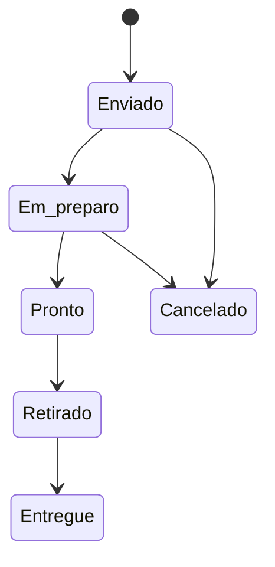

# PediRest

PWA mobile-first para gestão de pedidos em restaurantes. O MVP conecta o fluxo do garçom à produção, retirada, entrega e caixa em uma única interface responsiva.

   

## O que já funciona

- Garçom: visão das mesas, novo pedido, busca e categorias, carrinho, envio, retirada e entrega.
- Produção: painel Kanban, tempo de espera, prioridade e progressão de status.
- Caixa: comandas abertas, consumo detalhado, taxa de serviço e pagamento.
- Gestão: indicadores do turno, ranking, desempenho e disponibilidade de produtos.
- PWA: manifesto, ícone, service worker e cache básico do shell.
- Segurança: migration PostgreSQL com RLS multiestabelecimento.
- Confiabilidade: chave de idempotência, histórico de status e ausência de exclusão física de pedidos.
- Demonstração: dados persistidos no `localStorage`, sem exigir configuração externa.

## Executar localmente

Requisitos: Node.js 20 ou superior.

```bash
npm install
npm run dev
```

Acesse `http://localhost:5173`. Use o seletor no topo para alternar entre Garçom, Produção, Caixa e Gestão. As ações feitas em um perfil aparecem nos demais.

## Validação

```bash
npm run test
npm run build
```

## Conectar ao Supabase

1. Crie um projeto no Supabase.
2. Execute a migration em `supabase/migrations/202607180001_initial_schema.sql`.
3. Copie `.env.example` para `.env.local`.
4. Preencha `VITE_SUPABASE_URL` e `VITE_SUPABASE_ANON_KEY`.
5. Substitua o store de demonstração em `src/store.tsx` por um adaptador Supabase.

O schema já inclui estabelecimentos, perfis, mesas, setores, categorias, produtos, comandas, pedidos, itens, pagamentos, notificações, histórico, índices, RLS e tabelas no Supabase Realtime.

## Fluxo do pedido



## Próximos passos para produção

- Implementar login com Supabase Auth e convite de usuários.
- Trocar o store local pelo repositório Supabase e assinar Realtime.
- Adicionar fila offline com IndexedDB e retentativa exponencial.
- Configurar Web Push para alertas com a tela fechada.
- Conectar impressora térmica e abertura de caixa.
- Adicionar testes E2E para os quatro perfis.

## Estrutura principal

```text
src/
  pages/              # Garçom, produção, caixa e gestão
  components.tsx      # Shell, navegação e componentes comuns
  data.ts             # Dados de demonstração
  orderMachine.ts     # Regras de transição do pedido
  store.tsx           # Estado compartilhado e persistência local
supabase/migrations/  # Banco, RLS, índices e Realtime
public/               # PWA e service worker
```

## Licença

Projeto privado/comercial da Devsible. Adicione uma licença antes de redistribuir.
